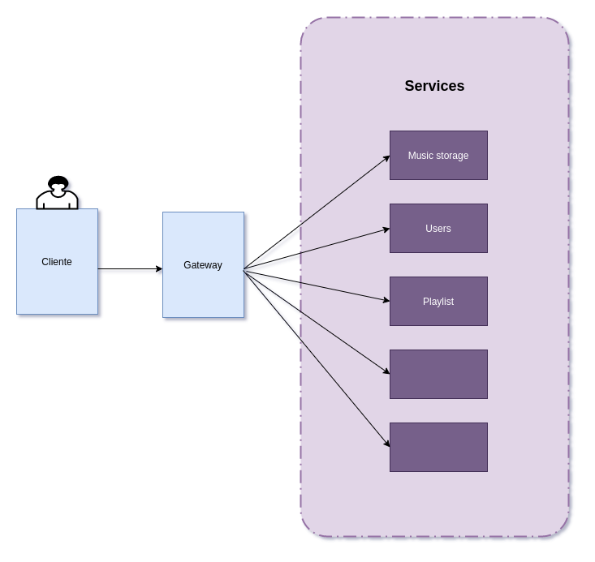

# Spotify

## Aplicación web

## Arquitectura de Microservicios

En la última década, los microservicios han emergido como una arquitectura dominante para el desarrollo de aplicaciones a gran escala. Esta arquitectura se caracteriza por la descomposición de una aplicación en un conjunto de servicios pequeños, independientes y altamente cohesivos, que se comunican entre sí a través de APIs bien definidas.  

Los microservicios son componentes autónomos que se centran en ejecutar una única funcionalidad de negocio, permitiendo que las aplicaciones sean más modulares y fáciles de gestionar. Cada microservicio es una aplicación en sí misma, con su propia lógica de negocio, base de datos y capacidades de comunicación. Las principales características de los microservicios incluyen:

- **Descomposición**: Cada servicio se centra en una sola responsabilidad o función de negocio.
- **Independencia**: Los servicios pueden ser desarrollados, desplegados y escalados de manera independiente, se ejecutan en un hilo/proceso/sistema separado
- **Descentralización**: La gestión de datos y el control de los servicios están descentralizados, permitiendo mayor flexibilidad y resiliencia.
- **Comunicación Ligera**: Los microservicios se comunican entre sí utilizando protocolos ligeros como HTTP/REST, gRPC o mensajería basada en eventos.

### Ventajas de los Microservicios

Adoptar una arquitectura de microservicios trae múltiples beneficios a una organización:

- **Escalabilidad**: Permite escalar partes específicas de la aplicación de manera independiente según la demanda, optimizando los recursos.
- **Flexibilidad Tecnológica**: Diferentes servicios pueden ser desarrollados con diferentes tecnologías que sean más adecuadas para su funcionalidad específica.
- **Mantenibilidad**: Al descomponer la aplicación en servicios más pequeños y manejables, el desarrollo, las pruebas y el despliegue se vuelven más ágiles y menos propensos a errores.
- **Resiliencia**: Fallos en un servicio no necesariamente afectan a toda la aplicación, lo que mejora la disponibilidad y la tolerancia a fallos.

### Aplicación en Spotify

Implementar un sistema distribuido como Spotify es un ejemplo ideal para aprovechar los beneficios de los microservicios. En un entorno como este, diferentes funcionalidades pueden ser divididas en servicios independientes, tales como el servicio de gestión de usuarios, el servicio de gestión de música, el servicio de recomendación de canciones, entre otros.  

## Roles

- Cliente: este rol se encarga de manejar las solicitudes del usuario y comunicarse con el
sistema de servidores distribuidos según sea necesario. Sus dos tareas principales
incluyen actualizar la lista de metadatos de la música y solicitar canciones específicas al
sistema para almacenarlas en cache y reproducirlas para el usuario.

- Gateway:

- Cada servicio

## Asignación de roles dinámicamente

## Coordinación

La coordinación es esencial para asegurar que múltiples componentes independientes trabajen juntos de manera coherente y eficiente. En un sistema distribuido, los nodos o servicios necesitan comunicarse y colaborar para cumplir con los objetivos del sistema global, manteniendo la consistencia, disponibilidad y tolerancia a fallos.

La coordinación abarca varios aspectos, incluyendo la sincronización de datos, la gestión de la concurrencia, la orquestación de tareas y la toma de decisiones distribuidas. Uno de los desafíos más importantes es manejar la elección de líderes y la coordinación entre nodos para asegurar que las decisiones se tomen de manera ordenada y confiable.

### Algoritmo Bully

 Este algoritmo es utilizado para seleccionar un nodo líder entre un grupo de nodos en un sistema distribuido. El nodo líder es responsable de coordinar las tareas y mantener la consistencia del sistema.  
 La elección de un líder es crucial en sistemas distribuidos porque el líder coordina las operaciones, toma decisiones críticas y gestiona la distribución de tareas entre los nodos. La elección de líderes asegura que el sistema pueda recuperarse de fallos de nodos y continuar operando de manera consistente y eficiente.

#### Funcionamiento del Algoritmo Bully

1. **Inicio**: Cuando un nodo detecta que el líder actual ha fallado, inicia una elección enviando un mensaje de elección a todos los nodos con IDs más altos que el suyo.
2. **Respuesta**: Si algún nodo recibe el mensaje de elección y tiene un ID mayor, responde con un mensaje de "OK" y también inicia su propia elección.
3. **Nueva Elección**: El nodo que inició la elección espera un tiempo para recibir respuestas. Si no recibe ninguna respuesta (lo que significa que no hay nodos con IDs mayores disponibles), se declara líder y envía un mensaje de "Líder" a todos los nodos.
4. **Reelección**: Si un nodo recibe un mensaje de "Líder" de un nodo con un ID más alto, acepta al nuevo líder. Si no recibe tal mensaje, eventualmente se declarará líder siguiendo los mismos pasos.  

Este proceso asegura que siempre haya un nodo líder que pueda coordinar las tareas y decisiones del sistema.

#### Relevancia en Spotify

En un sistema distribuido como Spotify, la coordinación y la elección de líderes son fundamentales por varias razones:

1. **Gestión de Sesiones**: Un líder puede gestionar las sesiones de los usuarios, asegurando que las conexiones y las reproducciones de música sean manejadas de manera ordenada.
2. **Consistencia de Datos**: Un líder coordina la sincronización de datos entre los servicios, asegurando que la información del catálogo de música, el historial de reproducción y las recomendaciones estén siempre actualizadas y coherentes.
3. **Escalabilidad y Resiliencia**: La elección dinámica de líderes permite que el sistema se recupere rápidamente de fallos y continúe funcionando sin interrupciones significativas, manteniendo una alta disponibilidad para los usuarios.
4. **Optimización de Recursos**: Un líder puede optimizar la distribución de tareas entre los nodos, balanceando la carga y mejorando el rendimiento general del sistema.

## Sincronización de tiempo

La sincronización se refiere al proceso de coordinar el tiempo y los eventos entre múltiples nodos. Dado que los nodos pueden operar de manera independiente y pueden no tener acceso a un reloj físico común, es crucial contar con mecanismos que aseguren que todos los nodos tengan una visión coherente del orden de los eventos.

La sincronización incluye:  
- **Sincronización de Relojes**: Alinear los relojes de los nodos para que tengan una visión común del tiempo.
- **Sincronización de Eventos**: Asegurar que los eventos se registren y procesen en el mismo orden en todos los nodos.
- **Coordinación de Tareas**: Orquestar la ejecución de tareas distribuidas para evitar conflictos y asegurar la coherencia.

### Algoritmo de Relojes de Lamport

Uno de los métodos más conocidos para la sincronización de eventos en sistemas distribuidos es el uso de los relojes lógicos de Lamport. Este algoritmo es utilizado para mantener un orden consistente de eventos en un sistema distribuido, incluso cuando los nodos no tienen un reloj físico sincronizado.

#### Funcionamiento de los Relojes de Lamport

1. **Inicialización**: Cada nodo en el sistema tiene un contador de reloj lógico, que se inicializa en cero.
2. **Evento Interno**: Cuando ocurre un evento interno en un nodo (como una operación o procesamiento), el nodo incrementa su contador de reloj en uno.
3. **Envío de Mensajes**: Cuando un nodo envía un mensaje a otro nodo, adjunta su contador de reloj lógico actual al mensaje.
4. **Recepción de Mensajes**: Al recibir un mensaje, el nodo receptor ajusta su contador de reloj al valor máximo entre su propio contador y el valor adjunto en el mensaje, y luego incrementa su contador en uno.
5. **Orden de Eventos**: Los eventos pueden ser ordenados según sus valores de reloj lógico, proporcionando una forma de determinar un orden parcial de los eventos en el sistema.

Este proceso asegura que los eventos en el sistema puedan ser ordenados de manera coherente, manteniendo una relación de causalidad entre ellos.

#### Importancia de la Coordinación y de los Relojes de Lamport

La sincronización de tiempo es crucial porque permite ordenar los eventos de manera consistente y mantener la coherencia del sistema. Los relojes de Lamport aseguran que, incluso sin un reloj físico sincronizado, los nodos pueden acordar un orden relativo de los eventos.

#### Relevancia en Spotify

En un sistema distribuido como Spotify, la sincronización de tiempo y el uso de los relojes de Lamport son fundamentales por varias razones:

1. **Registro de Eventos**: Permiten mantener un registro ordenado de eventos, como la reproducción de canciones, actualizaciones de playlists y acciones de usuarios, asegurando que los eventos se procesen en el orden correcto.
2. **Consistencia de Datos**: Ayudan a sincronizar actualizaciones entre nodos, garantizando que los datos de usuarios, playlists y recomendaciones estén siempre coherentes y actualizados.
3. **Depuración y Monitoreo**: Facilitan la depuración y el monitoreo del sistema al proporcionar un orden claro de los eventos, lo que es esencial para identificar y resolver problemas.
4. **Gestión de Concurrencia**: Permiten manejar la concurrencia de manera eficiente, asegurando que las operaciones conflictivas se resuelvan en un orden consistente.

## Nombrado

El nombrado se refiere a cómo se identifican y se accede a los recursos y servicios en el sistema. Un nombre en este contexto puede ser cualquier identificador que se utilice para referirse a un recurso, como un archivo, un nodo, un servicio o un usuario.

### Multicast

El multicast es una técnica de comunicación que permite enviar mensajes a múltiples destinatarios de manera eficiente. Se utiliza para gestionar la distribución y el acceso a nombres y recursos compartidos entre los nodos.

#### Funcionamiento del Multicast

1. **Identificación de Grupos**: Los nodos se agrupan en conjuntos según ciertos criterios, como la función que desempeñan o los recursos que comparten.
2. **Dirección Multicast**: Se asigna una dirección multicast a cada grupo, permitiendo que los mensajes enviados a esta dirección sean recibidos por todos los nodos del grupo.
3. **Envío de Mensajes**: Un nodo puede enviar un mensaje a la dirección multicast, y el mensaje será distribuido automáticamente a todos los miembros del grupo.
4. **Recepción de Mensajes**: Los nodos que pertenecen al grupo monitorizan la dirección multicast y procesan los mensajes recibidos según sea necesario.

Este proceso permite una comunicación eficiente y coordinada entre nodos que comparten recursos o necesitan mantener la coherencia en sus operaciones.

#### Ventajas del Multicast

- **Eficiencia**: Reduce la cantidad de mensajes necesarios para comunicar con múltiples nodos, mejorando el rendimiento y reduciendo el tráfico de red.
- **Escalabilidad**: Facilita la gestión de grandes grupos de nodos, permitiendo que nuevos nodos se unan o dejen el grupo dinámicamente.
- **Consistencia**: Ayuda a mantener la consistencia de los datos y el estado entre los nodos, asegurando que todos los miembros del grupo tengan la misma información.

#### Relevancia en Spotify

En un sistema distribuido como Spotify, el multicast en nombrado es fundamental por varias razones:

1. **Distribución de Actualizaciones**: Permite la distribución eficiente de actualizaciones de catálogo, listas de reproducción y otros datos a todos los nodos relevantes.
2. **Gestión de Usuarios**: Facilita la comunicación entre servicios que gestionan las sesiones de usuarios, asegurando que los cambios en el estado de un usuario se reflejen en todos los nodos necesarios.
3. **Sincronización de Reproducción**: Ayuda a sincronizar la reproducción de música entre diferentes dispositivos del usuario, asegurando una experiencia continua y coherente.
4. **Notificaciones en Tiempo Real**: Permite enviar notificaciones en tiempo real a múltiples usuarios o dispositivos, como actualizaciones de playlists o recomendaciones personalizadas.

## Consistencia y Replicación

lala

## Tolerancia a Fallas

• Disponibilidad
• Confiabilidad
• Seguridad
• Mantenibilidad

## Ejecución

lala

### Servidores

lala

### Clientes

lala
